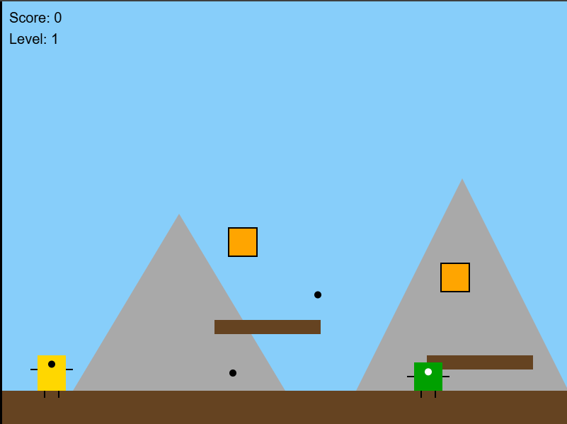

  
  <h1>Swiss Mountain Browser Game</h1>
  
  
<strong>HTML/JavaScript browser game created solely with the OpenAI o3-mini-high model.</strong>

  

Find source code <a href="game.html">here</a>

You can use one of the online HTML Editor like https://jsfiddle.net/ so run and test your code if you like.
Or just save it in a local file and open it with a browser. Happy prompting :)

Find below the prompt to try it yourself.

<b>Create a HTML5 / Javascript based browser game with the following requirements:<b>
<ul>
        <li>Add a welcome screen with "Press any key to START"</li>
        <li>General theme of the game is Switzerland.</li>
        <li>The main Character is a little creature with arms and legs and a face.</li>
        <li>Create 3 Levels</li>
        <li>Make each level several screen width long, so that the character can walk through the level.</li>
        <li>Design levels with obstacles to jump over. Make some interesting variations.</li>
        <li>Add boxes to interact with and to collect coins.</li>
        <li>Add animation when collecting coins from boxes.</li>
        <li>Add Scoring system</li>
        <li>Add Enemies green little mushrooms who need to be killed by shooting at them.</li>
        <li>Enemies have legs and arms and a face.</li>
        <li>There are several categories of enemies: slow, medium and fast. Some are patrolling some are approaching the main character.</li>
        <li>If the character dies, the game is reset.</li>
        <li>Design a meaningful ending of the level with a finish zone.</li>
</ul>
